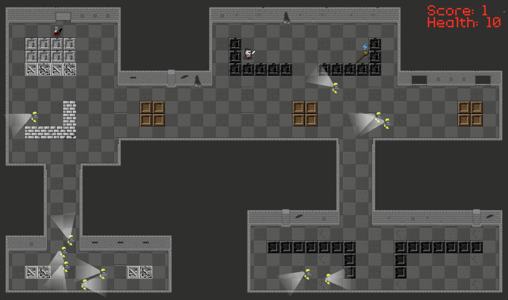

# Hunter-Kill


## This section is used for final class submission
- Họ và tên: Lê Đức Anh.
- MSSV: 23021463
- Giới thiệu game: thuộc thể loại Action Game và cảm hứng dựa trên `Assassin Hunter`

### Các điểm mạnh
1. Game tự viết từ đầu, không theo bất kì hướng dẫn mẫu nào (trừ việc sử dụng một vài đoạn mẫu có sẵn của cô).
2. Game có sử dụng đầy đủ các components cơ bản của SDL như SDL Image (hiển thị ảnh), SDL Mixer (chèn hiệu ứng âm thanh), SDL Font (hiển thị text).
3. Game có cấu trúc đầy đủ từ menu, chọn màn chơi, chơi lại game, có hiệu ứng âm thanh, bảng điểm.
4. Game sử dụng các thuật toán ngoài chương trình học
- Sử dụng [Context Steering Behavior AI](https://www.gameaipro.com/GameAIPro2/GameAIPro2_Chapter18_Context_Steering_Behavior-Driven_Steering_at_the_Macro_Scale.pdf) cho các enemy agent giúp chúng di chuyển tự nhiên hơn trong bản đồ.
- Xây dựng các class về Vector 2 chiều, Hình chữ nhật, hình tròn và xử lí giao giữa các thành phần này.
- Tính góc bắn cho enemy agent.

### Mức điểm tự đánh giá: 9.5 / 10

## Intro

Welcome to **Hunter-Kill**, a game project developed for my Advanced Programming Class' midterm using SDL2 C++.


## Usage (for macOS)

### Install GNU G++
You can install GNU G++ using [Homebrew](https://formulae.brew.sh/formula/gcc).

```bash
brew install gcc
```

### Download SDL2 Libraries
Download the following SDL2 libraries:
- [SDL2](https://github.com/libsdl-org/SDL/releases/tag/release-2.30.3)
- [SDL2_Image](https://github.com/libsdl-org/SDL_image/releases)
- [SDL2_TTF](https://github.com/libsdl-org/SDL_ttf/releases)
- [SDL2_Mixer](https://github.com/libsdl-org/SDL_mixer/releases)

### Clone this repository
```bash
git clone https://github.com/ducanh2706/Hunter-Kill.git
```

### Build and Run
```bash
cd Hunter-Kill
make
./main
```

## Tutorial

### Menu

In the main menu, select `Start` and choose the `level` you want to play.


You can toggle background music and SFX on/off by pressing `v` for on and `x` for off.


### In-game

Use the arrow keys (up, down, left, right) to move your knight and eliminate all enemies. Good luck!


